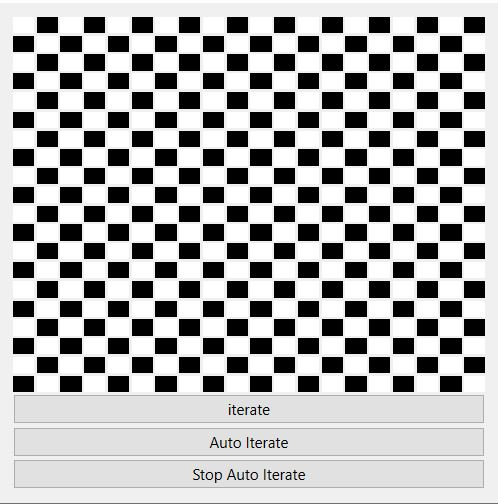
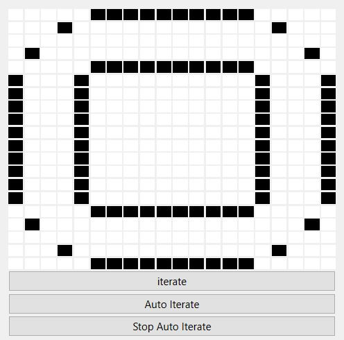

 
**Game of life C++**

> Author : CZARKOWSKI Matthieu

## **The project 📢**

The project aims to realize the game of life under PyQt with the MVC architecture.

The game of life is a cellular automaton evolving on a grid (of theoretically infinite size) composed of square boxes called cells which have a binary state (1 for alive and 0 for dead). The cells evolve in time according to their neighborhood (each cell has 8 neighboring cells).

Black cell : alive
White cell : dead

## **The prerequisites 📍**

### Language 📙

This project runs under c++, I advise you to install gcc for unix machines or mingw for windows machines

### Libraries 📚

#### 1. Qt 

**Qt_** is a library that allows you to create interfaces by offering different tools.

Qt : https://www.qt.io/download

## **How to use the application ❓**

First of all download or forker the whole project to have all the files and have qt design studio with Qt graphics library.

### Launch the program ▶️

#### 1. With qt design studio 💻

To use the program from the code, you need to run (start) the **main.cpp** file through a code editor like VSC.

Qt: https://www.qt.io/download

### The Game 🎲

You can customer the size of the grid in main.cpp, you can by clicking on the cubes to put a dead or live cell,
and also make an iteration or make automatic iterations.

